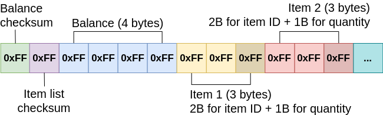

# Clevent

[Também disponível em Português](README_pt.md)

Clevent is an Android application developed for a Undergraduate Research that uses NFC technology to create a payment system that stores credits in NFC tags to manage visitor consumption at short-duration events and festivals. This project was presented at the 28th edition of SIICUSP (University of São Paulo's International Symposium of Undergraduate Research) in November 2020.

The application stores credits information and items consumed by the user in the NFC tags, thus being able to carry out operations such as balance recharging, issuing receipts and purchasing products entirely offline, without the need of a constant connection with a online server.

## Screenshots

    
    
    
    
    
    

## Application development

The application was developed using modern Android development techniques, including:

- Kotlin programming language.
- MVVM architecture.
- Architecture Components (Lifecycle, LiveData, ViewModel, Room).
- Single Activity Architecture with Navigation Component and Fragments.
- Unit tests with JUnit and Mockito.
- Hilt.
- Retrofit.
- Data Binding.

## Data serialization

NFC tags have an internal memory with restricted space, so it is necessary to optimize how it's used to store the data, keeping it possible to recover them without any loss.

The serialization generates a byte array that can be divided into three segments:

- **Segment 1 (2 bytes):** CRC checksum.
- **Segment 2 (4 bytes):** Credits as an integer value.
- **Segment 3 (3 bytes per item):** Each item uses 3 bytes, 2 bytes for item ID (short) and 1 byte for amount. An item can be divided and use more than 3 bytes if it has an amount greater than 1 byte is capable to store.

The byte array resulting from serialization is encrypted *(in development)* and stored in the NFC tag in the NDEF format.

## SIICUSP abstract

The abstract published in SIICUSP is available in English and Portuguese and can be downloaded together with this repository or [here](/docs/siicusp/).
