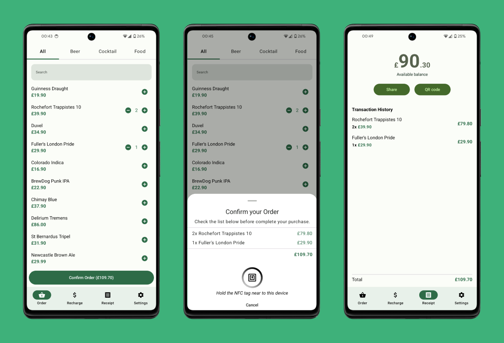

# Clevent

Clevent is an Android application developed for a Undergraduate Research that uses NFC technology to create a prepaid system that stores credits in NFC tags in NDEF format.
This project was presented at the 28th edition of SIICUSP (University of São Paulo's International Symposium of Undergraduate Research) in November 2020.

This application encrypts and stores the balance and a history of consumed items using the NDEF format allowing operations such as balance recharging, issuing receipts, and purchasing products entirely offline, without needing a constant connection to a remote server.

## Screenshots

## Application technical stack

The application was developed using modern Android development techniques, including:

- Jetpack Compose;
- Multi-module architecture;
- Dagger Hilt;
- Retrofit;
- Room;
- WorkManager;

## Data serialization

NFC tags have a very limited space to store data, so it's important to serialize the data efficiently to optimize space usage.

The serialization generates a byte array that can be divided into three segments:

- **Segment 1 (4 bytes):** Balance as an integer value.
- **Segment 2 (3 bytes per item):** List of items. Each item uses 3 bytes, 2 for ID and 1 for quantity.
- **Segment 3 (4 bytes):** CRC as an integer value.

The byte array resulting from serialization is then encrypted and stored on the NFC tag in NDEF format.

