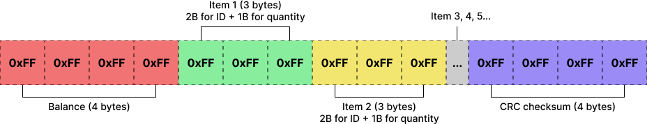

# Clevent

Clevent is an Android application developed for a Undergraduate Research that uses NFC technology to create a payment system that stores credits in NFC tags to manage visitor consumption at short-duration events and festivals. This project was presented at the 28th edition of SIICUSP (University of São Paulo's International Symposium of Undergraduate Research) in November 2020.

The application stores credits information and items consumed by the user in the NFC tags, thus being able to carry out operations such as balance recharging, issuing receipts and purchasing products entirely offline, without the need of a constant connection with a online server.

## Screenshots

    
    
    
    
    
    

## Application development

The application was developed using modern Android development techniques, including:

- Kotlin programming language.
- MVVM architecture.
- Architecture Components (Lifecycle, LiveData, ViewModel, Room).
- Single Activity Architecture with Navigation Component and Fragments.
- Unit tests with JUnit and Mockito.
- Hilt.
- Retrofit.
- Data Binding.

## Data serialization

NFC tags have a very limited space to store data, so it's important to serialize the data efficiently to optimize space usage.

The serialization generates a byte array that can be divided into three segments:

- **Segment 1 (4 bytes):** Balance as an integer value.
- **Segment 2 (3 bytes per item):** List of items. Each item uses 3 bytes, 2 for ID and 1 for quantity.
- **Segment 3 (4 bytes):** CRC as an integer value.

The byte array resulting from serialization is then encrypted and stored on the NFC tag in NDEF format.

