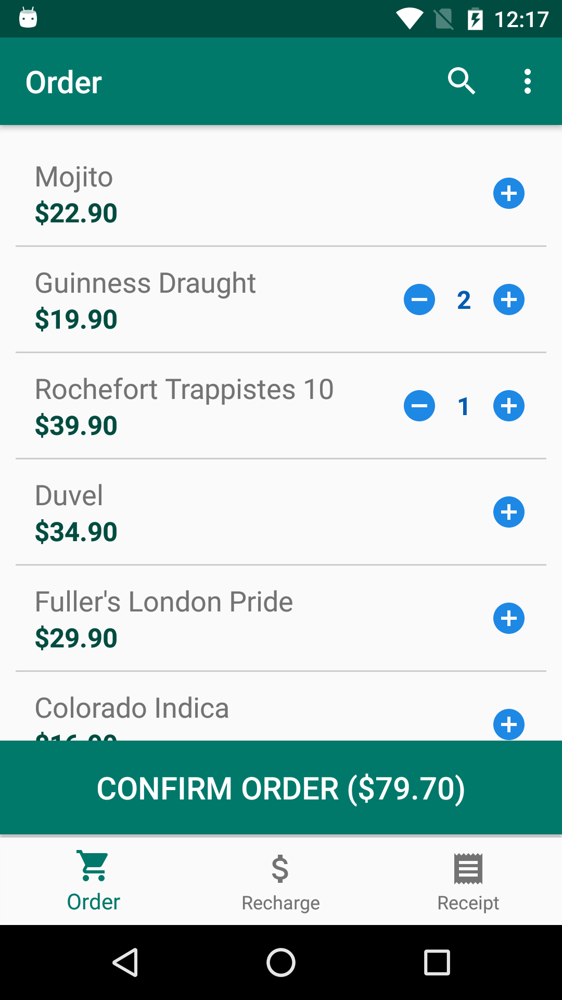
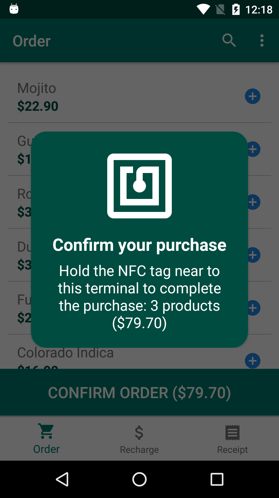
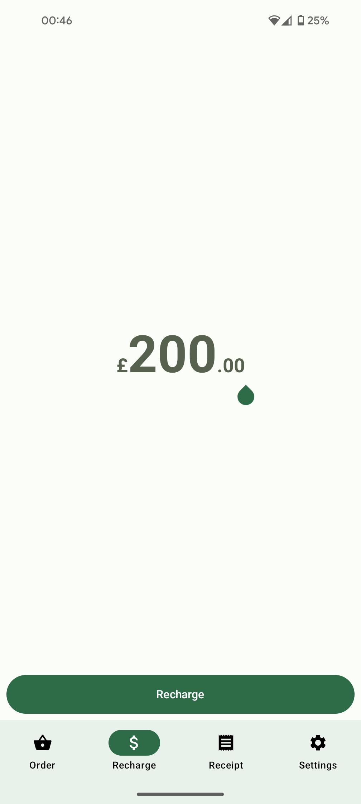
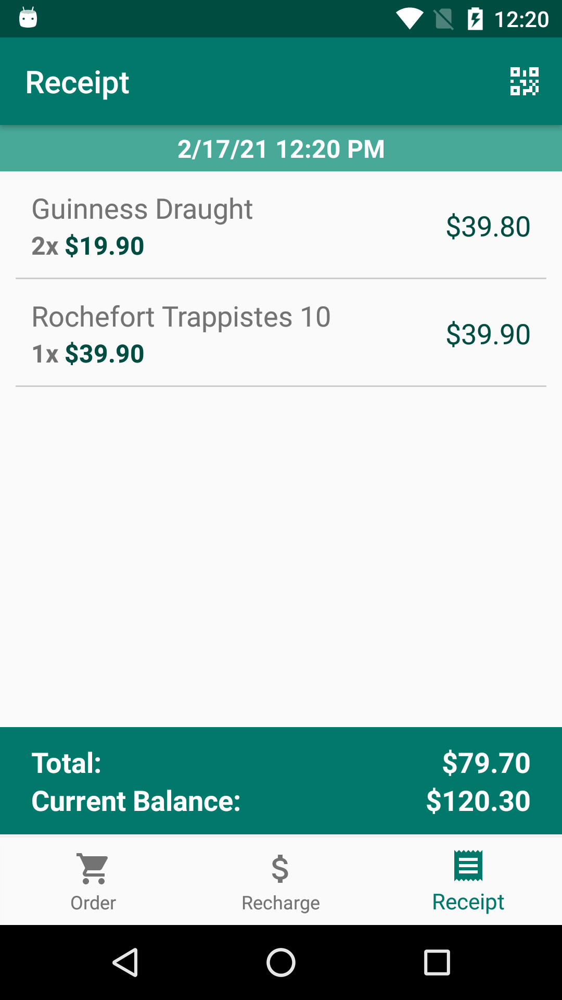
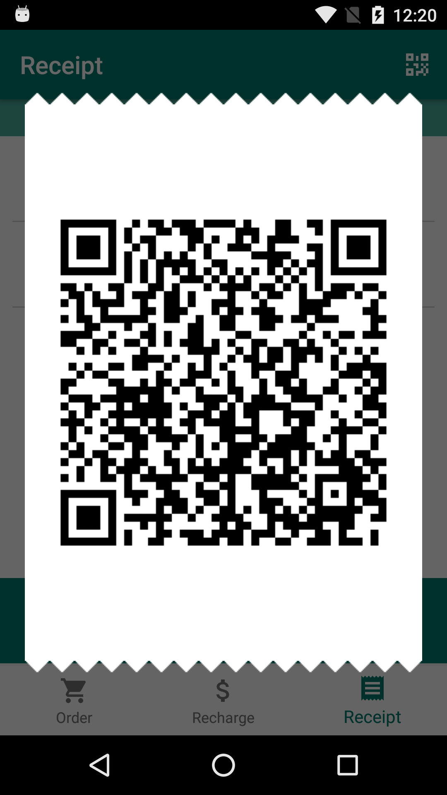
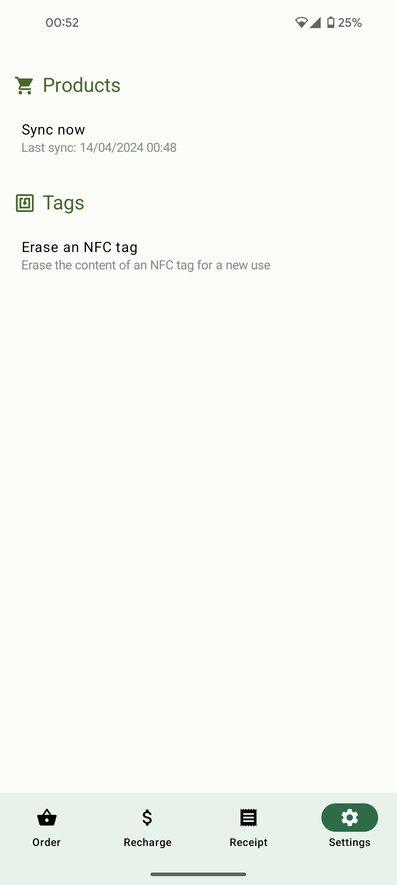
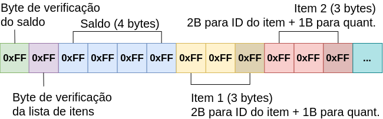

# Clevent

[Also available in English](README.md)

Clevent é um aplicativo Android desenvolvido para uma pesquisa de Iniciação Científica que utiliza a tecnologia NFC para criar um sistema de pagamentos que armazena créditos nas tags NFC para gerenciar o consumo de visitantes em eventos e festivais. O projeto foi apresentado na 28ª edição do SIICUSP (Simpósio Internacional de Iniciação Científica da USP) em novembro de 2020.

O aplicativo armazena nas tags NFC informações de saldo e itens consumidos pelo usuário, podendo, dessa maneira, realizar operações como recarga de saldo, emissão de recibos e compra de produtos totalmente offline, ou seja, sem a necessidade de uma conexão constante com um servidor central de processamento.

## Screenshots

    
    
    
    
    
    

## Desenvolvimento do Aplicativo

O aplicativo foi desenvolvido utilizando técnicas modernas de desenvolvimento Android, entre elas:

- Linguagem de programação Kotlin.
- Arquitetura MVVM.
- Architecture Components (Lifecycle, LiveData, ViewModel, Room).
- Single Activity Architecture com Navigation Component e Fragments.
- Testes unitários com JUnit e Mockito.
- Hilt.
- Retrofit.
- Data Binding.

## Serialização dos dados

As tags NFC possuem uma memória interna de tamanho restritivo, por isso é necessário otimizar o espaço utilizado para armazenar os dados, mantendo-se possível recuperá-los sem perdas.

A serialização gera um vetor de bytes que pode ser dividido em três segmentos:
- **Segmento 1 (2 bytes):** CRC para verificações de integridade dos dados.
- **Segmento 2 (4 bytes):** Saldo armazenado como um valor inteiro que representa a menor unidade monetária.
- **Segmento 3 (3 bytes por item):** 2 bytes para o ID do item e 1 byte para a quantidade consumida. Um item pode ser dividido e usar mais de 3 bytes caso possua uma quantidade maior que 1 byte é capaz de armazenar.

O vetor de bytes resultante da serialização é criptografado *(etapa em desenvolvimento)* e armazenado na tag NFC empacotado no padrão NDEF.

## Resumo SIICUSP

O resumo publicado no SIICUSP está disponível nos anais do evento em inglês e português e pode ser baixado junto com este repositório ou [aqui](/docs/siicusp/).
